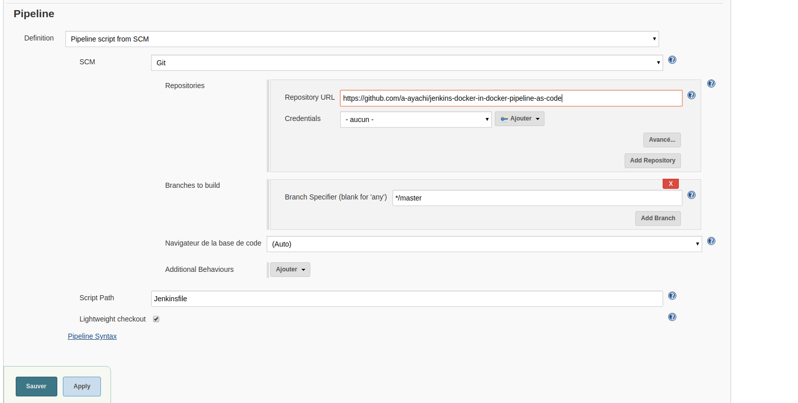

This is a simple example of how to use Jenkins, docker in docker and jenkinsfile (pipeline as code) to build
and push your docker image to docker hub.<br>
It's a simple Spring boot project that use mongodb, on the integration test we will use the docker-compose 
to define our mongo database.
<br>
We will construct our DIND (docker in docker) image that we will use to build the project, this image will contain
Java, maven, docker and docker-compose.
<br>
After building the project, we will build and push our docker image to docker hub.
##Setup Jenkins
**Create a network that will be used by jenkins and docker dind**
```bash
$ docker network create jenkins
```
**Create two volumes**
```bash
$ docker volume create jenkins-docker-certs
$ docker volume create jenkins-data
```
**Run docker dind where jenkins will execute docker commands**
```bash
$ docker container run --name jenkins-docker --rm -d \
  --privileged --network jenkins --network-alias docker \
  -e DOCKER_TLS_CERTDIR=/certs \
  -v jenkins-docker-certs:/certs/client \
  -v jenkins-data:/var/jenkins_home \
  -v "$HOME":/home docker:dind
```
**Run the jenkins image**
```bash
$ docker container run --name jenkins-container --rm -d \
    --network jenkins -e DOCKER_HOST=tcp://docker:2376 \
    -e DOCKER_CERT_PATH=/certs/client --env DOCKER_TLS_VERIFY=1 \
    -v jenkins-data:/var/jenkins_home \ 
    -v jenkins-docker-certs:/certs/client:ro \
    -v "$HOME":/home \ 
    -p 8080:8080 jenkinsci/blueocean
```

    
**Setup jenkins** <br>
Go to http://localhost:8080, and put the Administrator password to unlock Jenkins (use the command above to get the admin password)
```bash
$ docker exec -it jenkins-container cat /var/jenkins_home/secrets/initialAdminPassword
```

##Prepare the maven-dind docker image
This image will be used as agent to build our project on jenkins, it contain maven, java docker and docker-compose
```bash
$ cd maven-dind
$ docker build -t maven-dind .
```
You can publish this image to your docker hub account
```bash
$ docker login -u your_user_name -p your_password
$ docker tag maven-dind your_user_name/repository
$ docker push your_user_name/repository
```
##Configure the docker hub credentials on Jenkins


## Create new pipeline project

## Configure your pipeline

<br><br>
After the pipeline configuration, you can start building the project <br>
When the build finish you can see the result using **Open blue Ocean**

<br><br>
You can check your docker hub account for the new image.
<br>


